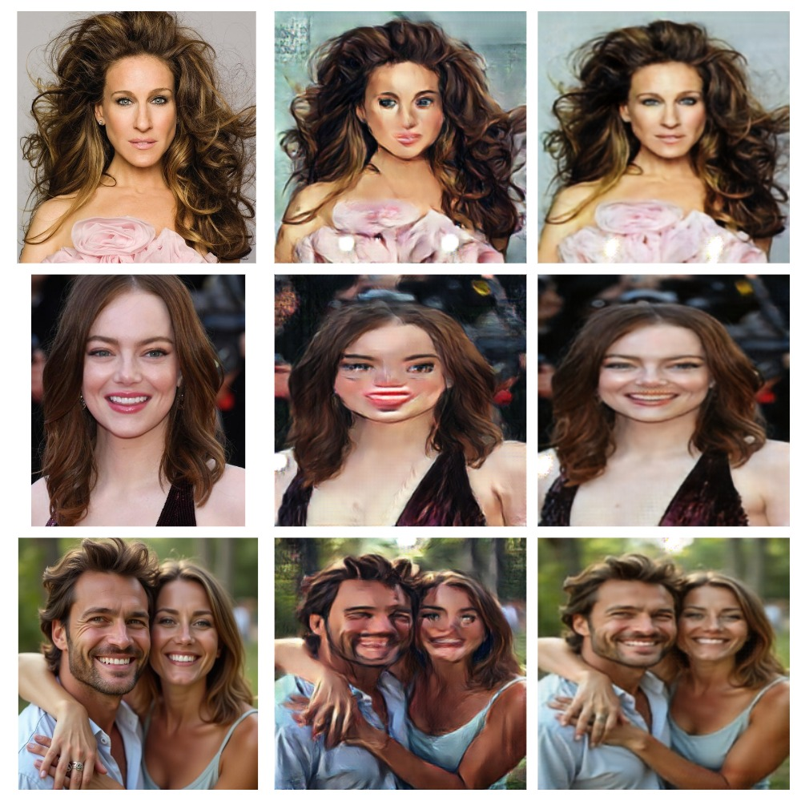

CycleGAN (Cycle Generative Adversarial Network) is unpaired Image-to-Image translation. 
Traditional GANs need paired data means each input image must have a matching output image. 
But finding such paired images is difficult. CycleGAN can change images from one style to another without needing matching pairs.
It understands the features of the new style and transforms the original images accordingly. 
This makes it useful for tasks like changing seasons in photos, turning one animal into another or converting pictures into paintings.
Architecture as:

CycleGAN has two generators G_X_Y and G_Y_X:
- G_X_Y creates new images in the target style
- G_Y_X transforms generated image back

CycleGAN has two discriminators D_X and D_Y whom decide if images are real or fake 
- D_X distinguishes between real images(x) and generated images G_Y_X(y)
- D_Y distinguishes between real images(y) and generated images G_X_Y(x)

Training CycleGANs can be highly unstable. I experimented with different techniques to stabilize training, including:
- Noise injection and label smoothing for discriminators
- Flip augmentations
- Learning rate tuning and schedulers
- Varying loss weights for cycle and identity loss

Notes:

This was my first deep learning project built from scratch. While the results are not perfect, I gained a lot of hands-on experience working with GANs.
My dataset was relatively small (1000 style images and 250 photos), so I believe that increasing the dataset size could improve the results significantly.
Below are a few examples of my model’s outputs after ~140 epochs of training.
The model version provided here is the best among those trained, and demonstrates key ideas of the CycleGAN architecture.

